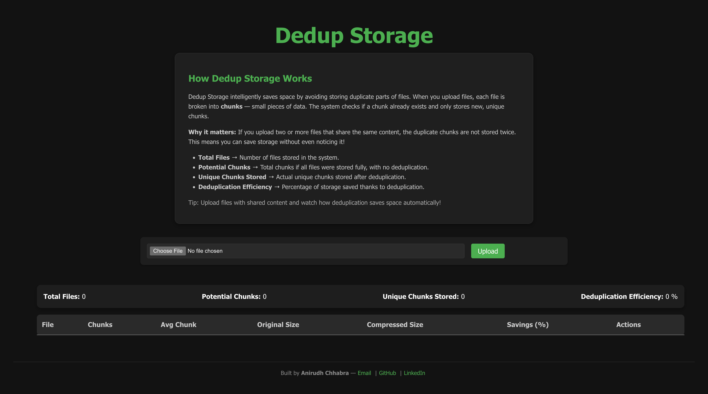
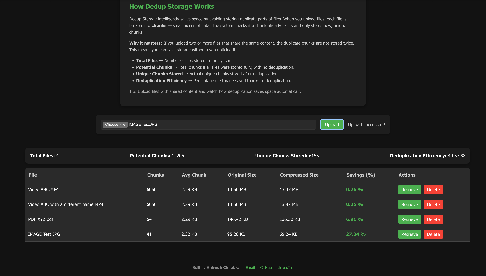

# Dedup Storage

**Dedup Storage** is a modern, web-based storage system that intelligently reduces redundant data by storing only unique chunks of files. Upload multiple files with overlapping content, and the system ensures duplicates aren’t stored twice — saving space automatically and efficiently.

---

## Features

- **Deduplication:** Files are broken into *chunks*, and duplicate chunks are only stored once.
- **Real-time stats:** Track the number of files, potential chunks, unique chunks, and deduplication efficiency.
- **File management:** Upload, retrieve, and delete files through a simple and clean interface.
- **Smart compression awareness:** See actual file sizes before and after storage.
- **Interactive web interface:** Easy-to-use React frontend with clear statistics and visual feedback.

---





---

## How it Works

1. When a file is uploaded, it’s split into **small chunks**.
2. Each chunk is compared against chunks already stored in the system.
3. Only **unique chunks** are saved, while duplicates are ignored.
4. The system calculates:
   - **Potential Chunks:** Total chunks if all files were stored fully.
   - **Unique Chunks Stored:** Actual chunks stored after deduplication.
   - **Deduplication Efficiency:** How much storage is saved thanks to deduplication.

> Example: Uploading two files with shared content only stores the common chunks once — saving space automatically.

---

## 💻 Tech Stack

- **Frontend:** React, CSS (custom styling)
- **Backend:** Node.js, Express.js
- **File Handling:** Multer for file uploads
- **Deduplication CLI:** Custom compiled dedup binary (Windows, macOS, Linux)
- **CORS:** For frontend-backend communication
- **Storage:** Local file system with chunk-level deduplication

---

## Installation

1. **Clone the repository**
```bash
git clone https://github.com/chhabra-anirudh/dedup-storage.git
cd dedup-storage
```

2. **Install backend dependencies**
```bash
cd dedeup-web/backend
npm install
```

3. **Install frontend dependencies**
- Run inside dedup-storage/dedeup-web/frontend/vite-project
```bash
cd ../frontend/vite-project
npm install
```

4. **Start backend**
- Run inside dedup-storage/dedeup-web/backend
```bash
cd ../../backend
node server.js
```

5. **Start frontend**
- Run inside dedup-storage/dedeup-web/frontend/vite-project
```bash
cd ../frontend/vite-project
npm run dev
```

## Usage

- Open the web interface (React app) in your browser.
- Upload files using the File Upload component.
- View file stats and overall storage savings.
- Retrieve or delete files directly from the web interface.
- CLI can also be used directly for advanced workflows:

## Goals & Benefits
- Save storage space automatically.
- Highlight deduplication efficiency to users.
- Demonstrate chunk-based file storage and analytics.
- Provide a clean, professional web interface for personal or small-scale storage management.

**CLI Commands**
- Run inside **root** i.e. dedup-storage
```bash
./executables/<os-system-architecture>/<dedup-executable-name> store <filename> <chunk_size>
./executables/<os-system-architecture>/<dedup-executable-name> list
./executables/<os-system-architecture>/<dedup-executable-name> retrieve <filename>
./executables/<os-system-architecture>/<dedup-executable-name> delete <filename>
```

## Contact Me:
Anirudh Chhabra
- Email: anirudhbuilds@gmail.com 
- GitHub: https://github.com/chhabra-anirudh
- LinkedIn: https://www.linkedin.com/in/anirudh-chhabra-cs/
